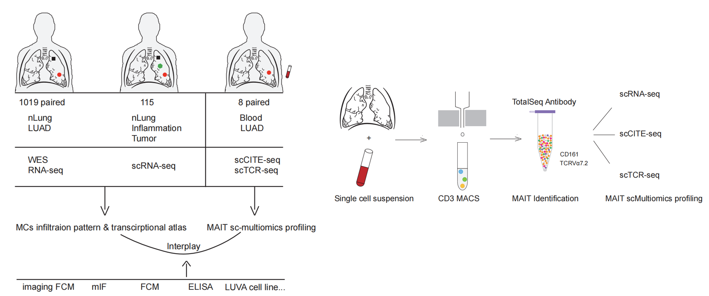
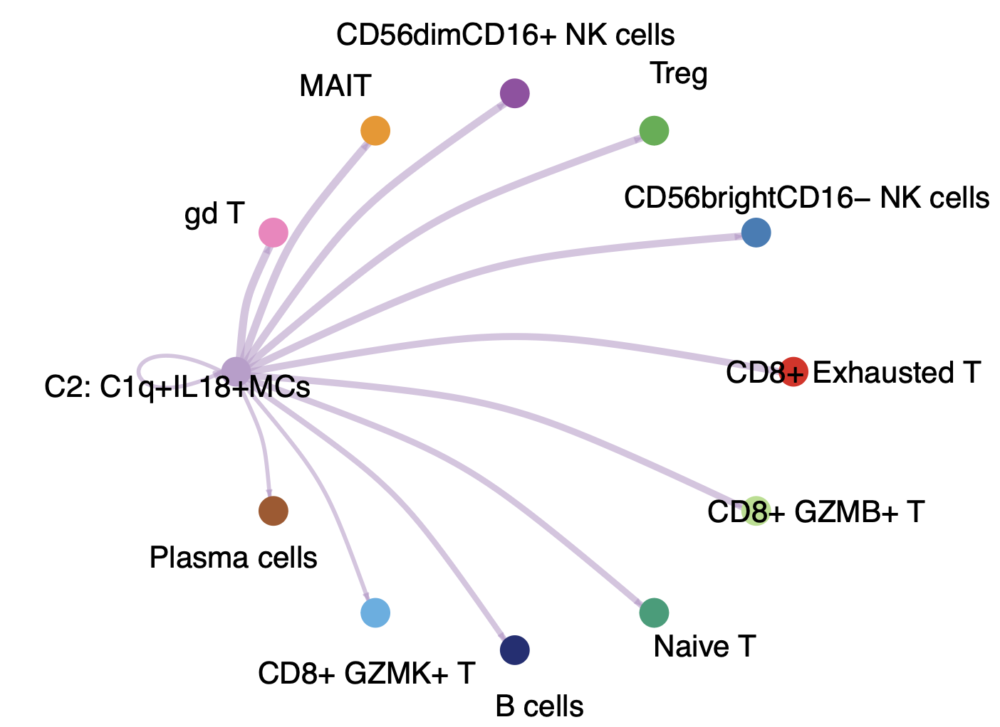

# Mast cells boost anti-tumor potency of MAIT cells via inflammasome activation

<br>




<center> --------------------Fig1 : Data Overview and Sequencing Diagram--------------------</center>

<br>
<br>


This repository includes  codes and data example used in the 'Mast cells boost anti-tumor potency of MAIT cells via inflammasome activation' paper.

<br>


## Summary📖

The focus of our study is to provide an atlas of previously unappreciated mast cells in lung adenocarcinoma (LUAD) and comprehensively elucidate their infiltration patterns, 
heterogeneity, and mechanisms in the LUAD microenvironment. We utilized whole genome 
sequencing (WGS) and RNA sequencing (RNA-seq) on 1019 paired normal lung tissues and 
LUAD and enrolled the flow cytometry cohort and TMA cohort to study the dynamic patterns 
of mast cells during LUAD progression (from indolent to invasive LUAD). We constructed a 
large single-cell transcriptional profiling of mast cells covering 115 samples to unravel the heterogeneity of mast cells and identified 9 distinct states of mast cells, including chemotaxis, antigen presentation, and proinflammation. More details in **manuscripts**

<br>


## Requirements🌸

●**Python (version 3.8.17)**

- [ ] scanpy package(version 1.9.8)

- [ ] numpy package(version 1.26.4)

- [ ] sctour package(version 1.0.0)

- [ ] pyscenic package(version  0.12.1+8.gd2309fe)

●**R (version version 4.3.1)**

- [ ] r-seurat (version 5.1.0)

<br>

☞ More details in **requirements_pyscenic.txt**

<br>

## Usage👻

To run this analysis pipline, you need to first create a python virtual environment (Python : 3.8.17 & R : 4.3.1) where you can install all the required packages. If you are using the conda platform to create your virtual environment. These are the steps you need to follow.

<br>

#### Virtual environment construction

All operations are completed in your terminal.

First, let us create the virtual environment with all packages: 

```
conda create -n [virtual_environment_name] --file requirements_pyscenic.txt
```

Next, you need to activate the virtual environment:

```
conda activate [virtual_environment_name]
```

The above process takes approximately 1-2 hours.Once you have the `[virtual_environment_name]` ready, you can run all scripts!

<br>

#### Script Description

●`Figure_4A.R` is used to visualize the communication connections between C1q+IL18+MCs and other cells. So you need to run it first.

```
cd [your_path]/script
```

and then

```
Rscript Figure_4A.R 
```

It takes approximately 3 minutes to draw the result image. (Computing machine: Macbook Air  M1 core)

<br>



<center>--------------------Fig2 : Cell communications between C1q+IL18+MCs and other cells--------------------</center>

<br>


# Data

All data have been uploaded to the GSA (https://ngdc.cncb.ac.cn/gsa/) and Zenodo (https://zenodo.org/) and will be available for download upon acceptance for publication.


<br>

# Citation

Paper is now under review at Nature Communications.

